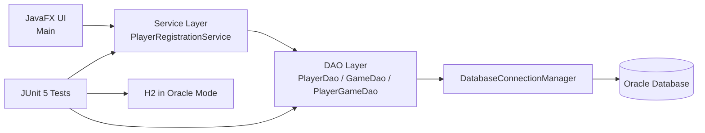

# Java JDBC Player Registration System

[](https://github.com/Jaturaput-Jongsubcharoen/Java-JDBC-Player-Registration-System/actions/workflows/ci.yml)

A JavaFX desktop application for managing players, games, and player-game results with a layered JDBC architecture. The codebase is organized for maintainability and portfolio-grade engineering practices, including automated tests and GitHub Actions CI.

## Key Features

- JavaFX desktop UI for create, update, delete, and reporting workflows
- Layered architecture: UI -> service -> DAO -> connection manager -> database
- JDBC `PreparedStatement` usage for parameterized SQL operations
- Transactional service workflows for multi-table consistency
- Config-driven database connectivity via `database/db.properties`
- Automated tests with JUnit 5 and H2 in Oracle compatibility mode
- CI workflow that runs Maven tests on pull requests and pushes to `main`

## Technology Stack

- Java 17
- JavaFX 21
- Maven
- JDBC
- Oracle SQL (production/local runtime target)
- H2 (test database in Oracle compatibility mode)
- JUnit 5
- GitHub Actions

## Architecture

High-level flow:

- JavaFX UI (`Main`) orchestrates user interactions
- Service layer (`PlayerRegistrationService`) manages business workflows and transactions
- DAO layer (`PlayerDao`, `GameDao`, `PlayerGameDao`) executes SQL
- `DatabaseConnectionManager` handles configuration loading and JDBC connections
- Oracle database stores production data.
- H2 in Oracle compatibility mode is available for local demonstrations and automated tests.



## Project Structure

```text
.github/workflows/ci.yml
database/
  db.properties.example
  db.test.properties
  schema.sql
  sample-data.sql
docs/
  database-schema.md
src/
  main/
    java/playerregistration/
      Main.java
      service/
      dao/
      database/
  test/
    java/playerregistration/
      service/
      dao/
      testsupport/
```

Important components:

- `src/main/java/playerregistration/Main.java`: JavaFX UI and input handling.
- `src/main/java/playerregistration/service/`: Transactional application workflows.
- `src/main/java/playerregistration/dao/`: SQL operations for `Player`, `Game`, and `PlayerAndGame`.
- `src/main/java/playerregistration/database/`: `DatabaseConnectionManager` for config loading, JDBC URL-based driver initialization, and connection creation.
- `src/test/`: JUnit test suite (service and DAO behavior) plus test DB support utilities.
- `database/schema.sql` and `docs/database-schema.md`: schema reference artifacts.
- `.github/workflows/ci.yml`: CI pipeline running Maven tests.

## Database Design

The runtime application model uses three core tables:

- `Player`: player profile records
- `Game`: game catalog records
- `PlayerAndGame`: linking table with gameplay attributes (`player_date`, `score`)

Relationship model:

- `PlayerAndGame.player_id` references `Player.player_id`
- `PlayerAndGame.game_id` references `Game.game_id`
- Supports many-to-many association between players and games through the linking table

Reference SQL scripts and documentation are available in:

- `database/schema.sql`
- `database/sample-data.sql`
- `docs/database-schema.md`

## Transaction Management

Related create/update/delete operations in the service layer are handled in a single JDBC transaction:

- Acquire one `Connection`
- Call `setAutoCommit(false)`
- Execute related DAO operations
- `commit()` on success
- `rollback()` on failure

This pattern is implemented in `PlayerRegistrationService` for consistency across multi-table writes.

## Security and Configuration

- `database/db.properties.example` is the committed template.
- Create a local `database/db.properties` with your own Oracle connection values.
- Real credentials are not committed.
- Tests use `database/db.test.properties` with test-only H2 credentials.

## Testing

The automated test suite uses:

- JUnit 5
- H2 in Oracle compatibility mode (`MODE=Oracle`)
- Service and DAO tests under `src/test/java/playerregistration/`

Current automated test scope includes transactional workflows and DAO behavior, including rollback scenarios.

Run tests locally with:

```bash
mvn clean test
```

## CI/CD

GitHub Actions automatically runs Maven tests using JDK 17 on:

- Pull requests
- Pushes to `main`

Workflow file:

- `.github/workflows/ci.yml`

## Local Setup

1. Install JDK 17.
2. Install Maven 3.9+.
3. Copy `database/db.properties.example` to `database/db.properties`.
4. Configure Oracle JDBC URL, username, and password in `database/db.properties`.
5. Run the application:

```bash
mvn clean javafx:run
```

6. Run the automated tests:

```bash
mvn clean test
```

## Screenshots

### Main Application Window


Main JavaFX application window showing the player information form, game information form, and primary action buttons before any workflow is executed.

### Creating a Player


Successful create workflow after entering player and game data, demonstrating record creation and the create status message.

### Displaying Players and Games


Reporting view opened from `Display All Players`, showing the joined player/game results loaded from the database in a table.

### Updating an Existing Player


Update workflow using an existing player ID to modify the current player row and its related game and score data without creating a new player ID.

### Validation and Error Handling


Validation example highlighting incorrect or incomplete user input and the inline field-level error messages shown in the UI.

## Future Improvements

- Expand DAO test coverage for edge cases and SQL constraints
- Add JavaFX UI automation tests
- Improve concurrency-safe generated ID handling strategy
- Add structured logging for operational diagnostics